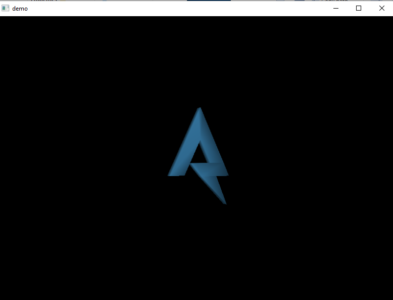
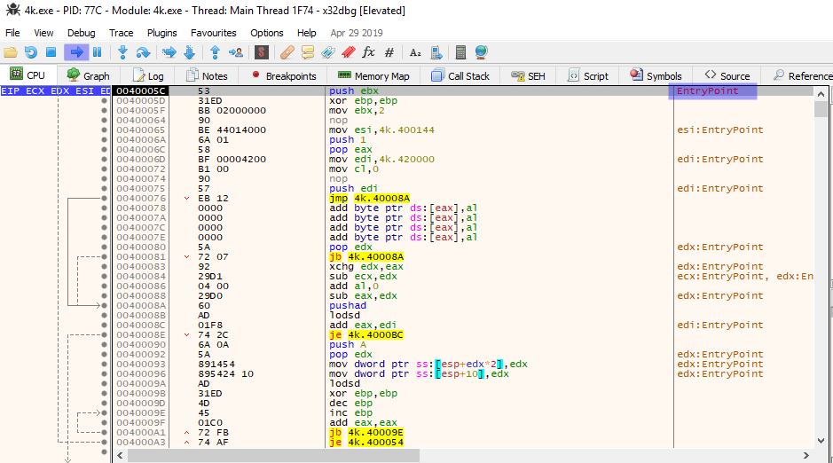
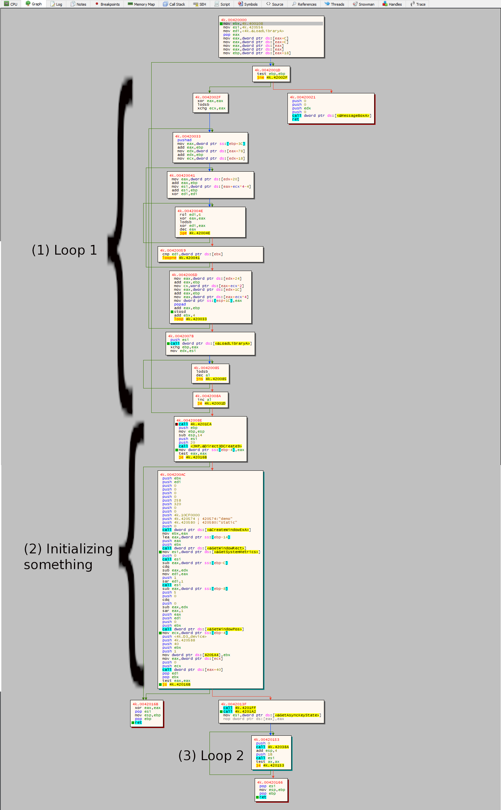
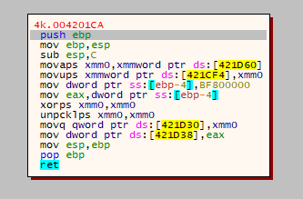

demo <!-- omit in toc -->
---

```
Someone on the Flare team tried to impress us with their demoscene skills. It seems blank. See if you can figure it out or maybe we will have to fire them. No pressure.
```

```
$ file 4k.exe 
4k.exe: MS-DOS executable
```

- [Introduction](#introduction)
- [Information Collection](#information-collection)
  - [Loop 1](#loop-1)
  - [Initialization](#initialization)
    - [<0x4201ff> function](#0x4201ff-function)
    - [<0x4201a2> function](#0x4201a2-function)
  - [Loop 2](#loop-2)
    - [<0x42038a> function](#0x42038a-function)
- [Solution](#solution)

## Introduction
From the `file` command, this is a windows executable.

[demoscene](https://en.wikipedia.org/wiki/Demoscene)?, so this might be some kind of drawing?

Tried to static analysis this using `Ghidra`.
There was only **one** function: `entry`, which seems very weird to have only
one function, seemed a complex function and didn't try to analyze it.

So I used `dynamic analysis` to solve this challenge.
<br>
I'm using `x32dbg` as my main dynamic analysis tool.

## Information Collection

First, lets run the program. This is the output:


Its showing 3D drawing of `flare` logo and its rotating.
<br>
From the code of entry there was no 3D functions, nor Windows functions.
<br>
I'm guessing that this is a unpacking procedure. (self building code).

Now to debugging:

EntryPoint:
<br>


Because `entry` unpacks code, I guess it might return to it As there is no where out of `entry` except that.


Then, I used `x32dbg` `graph` function, to make the function more readable in the debugger.

Lets call this function `main`.

This is the graph:

> This graph is taken after the execution has completed `loop 1` (Explained later)



There are 3 main parts in this function.
- `Loop 1`
- `Initialization`
- `Loop 2`

Before getting into analyzing this function. If we tried to return from this function, it does not return and the 3D animation starts playing.
<br>
So, now we know that all the important things are inside this function, also because there are GUI and 3D related functions as shown in the graph.

### Loop 1

From the graph, `loop 1` is not only one loop, and rather more than one loop inside each other.

In loop 1, at the top right it checks for something. 
If its **true**, then it calls [MessageBoxA][MessageBoxA] maybe to show error message then return.
<br>
So, its not important.

It's noticed that there is one `call` instruction in this loop which calls [LoadLibraryA][LoadLibraryA] function. (which loads a `.dll` file). And all other instructions are moving data around and XORing, shifting and other stuff.

`LoadLibraryA` is being called 3 times with:

- `user32`    -> Windows and other things
- `d3d9`      -> 3D DirectX
- `d3dx9_43`  -> 3D DirectX


And the other shifting and moving data, is maybe to import the member functions needed by this program.

> The reason the graph was taken after this loop is that, this loops 
initializes some function references related to the `dll`s loaded.
So if the graph taken after the loop, the names of the
functions will appear in the debugger.

### Initialization

First, `0x4201ca` is being called.
<br>
Its a small function, that return `0xBf800000` after moving float data around
some addresses. (not sure what is the purpose of it).



Second, [Direct3DCreate9][Direct3DCreate9] is being called with `0x20` as a version number to initialize IDirect3D9 interface object.

Then, some series of function calls.
I created this C-pseudocode code from the graph above. 

``` C
RECT rect;  // holds the data for window rect object

HWND handler = CreateWindowExA(
    0,
    "static",   // class name
    "demo",     // window name
    0x10CF0000, // pointer to style DWORD (not importnant)
    0,          // x 
    0,          // y
    0x320,      // width
    0x258,      // height
    0, 0, 0, 0);

// request the rect measurements of the rect, using positions
// top, bottom, right, left
GetWindowRect(handler, &rect);

// compute the position of the window to be in middle horizontally
$edi = (GetSystemMetrics(SM_CXSCREEN /* == 0*/) - rect.right) / 2;  
// compute the position of the window to be in middle vertically
$eax = (GetSystemMetrics(SM_CYSCREEN /* == 1*/) - rect.bottom) / 2;

setWindowPos(handler, 0, $edi, $eax, 0, 0, 0x5);    // sets the window in the middle of the screen
```

[CreateWindowExA][CreateWindowExA]
<br>
[GetWindowRect][GetWindowRect]
<br>
[RECT][RECT]
<br>
[GetSystemMetrics][GetSystemMetrics]
<br>
[SetWindowPos][SetWindowPos]


Next, in the same big block.
<br>
A method from IDirect3D9 object is being called.(v-table)
<br>
After some research, that is [CreateDevice][CreateDevice].

``` C
IDirect3D9_object.CreateDevice(
    0,
    D3DDEVTYPE_HAL,     // == 1
    handler,            // from createWindowExA
    40,
    <ptr>,              // D3DPRESENT_PARAMETERS
    <ptr2>              // IDirect3DDevice9 result ptr
);
```

Lastly, before `loop 2` if the result of `createDevice` is not `0` it calls two functions:`
- function at <`0x4201ff`>
- function at <`0x4201a2`>

When debugging normally, I couldn't find what these functions and the function inside `loop 2` does.

> during the competition I used [apitrace][apitrace] to get the functions names in
> DirectX (I didn't use the tool to inspect 3D object). Then learned later that I
> can get these function names from `.pdb` files (debug symbols file) to work
> with `x64dbg` so I'm doing it here.

Microsoft has repository for `.pdb` files for its dlls, and `x64dbg`
can be used to download them, for each module.

> You need to download symbols after `loop 1`, because 
these dlls are only loaded during `loop 1`.

After downloading the symbols trying to check `createDevice` call again.


And its right there. NICE.

#### <0x4201ff> function


This is a straight through function without jumps

First, it calls `0x4202ab` function. Looking through the method it appears that it 
initialized some kind of `mesh` object using
[D3DXCreateMeshFVF][D3DXCreateMeshFVF]
and other functions. So I called it `m_createMesh` and the results are stored
in global locations.

Interesting observation is that this method is called twice with different arguments.
> only captured the interesting arguments.

1) NumFaces = 0x038( 56),  NumVertices = 0x01E( 30)
2) NumFaces = 0x10A(266),  NumVertices = 0x128(296)

There are **two** meshes inside this program, I guess the smaller one is for the logo,
And the large one might be for the **`flag`**, because it looks like a complex 3D mesh.
<br>
This is good progress, now we know that the `flag` might not text and rather 3D drawing but we still don't know why it's not drawn.

After that there are `4` calls to [IDirect3DDevice9::SetRenderState][IDirect3DDevice9__SetRenderState]
which are not very important to get the flag.

#### <0x4201a2> function
This is a very small function with only `2` function calls.


1) [IDirect3DDevice9::SetLight][IDirect3DDevice9__SetLight]
2) [IDirect3DDevice9::LightEnable][IDirect3DDevice9__LightEnable]

These are not important for us to solve this challenge.

### Loop 2

In this loop there are only `2` function calls.

1) [<0x42038a> function](#<0x42038a>-function)
2) `GetAsyncKeyState(VK_ESCAPE /* 0x1B */)` to check for clicks for `ESC` key.

#### <0x42038a> function

Looks like this function only calls library functions/methods and does not do any calculation by itself.

This is the calls in these function in order:

- [IDirect3DDevice9::Clear](https://docs.microsoft.com/en-us/windows/win32/api/d3d9/nf-d3d9-idirect3ddevice9-clear)
- [IDirect3DDevice9::BeginScene](https://docs.microsoft.com/en-us/windows/win32/api/d3d9/nf-d3d9-idirect3ddevice9-beginscene)
- [IDirect3DDevice9::SetFVF](https://docs.microsoft.com/en-us/windows/win32/api/d3d9/nf-d3d9-idirect3ddevice9-setfvf)
- [D3DXMatrixLookAtLH](https://docs.microsoft.com/en-us/windows/win32/direct3d9/d3dxmatrixlookatlh)
- [IDirect3DDevice9::SetTransform](https://docs.microsoft.com/en-us/windows/win32/api/d3d9/nf-d3d9-idirect3ddevice9-settransform)
- [D3DXMatrixPerspectiveFovLH](https://docs.microsoft.com/en-us/windows/win32/direct3d9/d3dxmatrixperspectivefovlh)
- [IDirect3DDevice9::SetTransform](https://docs.microsoft.com/en-us/windows/win32/api/d3d9/nf-d3d9-idirect3ddevice9-settransform)
- [D3DXMatrixTranslation](https://docs.microsoft.com/en-us/windows/win32/direct3d9/d3dxmatrixtranslation)
- [D3DXMatrixRotationY](https://docs.microsoft.com/en-us/windows/win32/direct3d9/d3dxmatrixrotationy)
- [D3DXMatrixRotationY](https://docs.microsoft.com/en-us/windows/win32/direct3d9/d3dxmatrixrotationy)
- [IDirect3DDevice9::SetMaterial](https://docs.microsoft.com/en-us/windows/win32/api/d3d9/nf-d3d9-idirect3ddevice9-setmaterial)
- [IDirect3DDevice9::SetTransform](https://docs.microsoft.com/en-us/windows/win32/api/d3d9/nf-d3d9-idirect3ddevice9-settransform)
- [ID3DXBaseMesh::DrawSubset](https://docs.microsoft.com/en-us/windows/win32/direct3d9/id3dxbasemesh--drawsubset)
[Important] Draw the first mesh (the small one).
- [D3DXMatrixMultiply](https://docs.microsoft.com/en-us/windows/win32/direct3d9/d3dxmatrixmultiply)
- [IDirect3DDevice9::SetTransform](https://docs.microsoft.com/en-us/windows/win32/api/d3d9/nf-d3d9-idirect3ddevice9-settransform)
[Important] Do some transformation to the screen view (camera?)
- [ID3DXBaseMesh::DrawSubset](https://docs.microsoft.com/en-us/windows/win32/direct3d9/id3dxbasemesh--drawsubset)
[Important] Draw the second mesh (the large one).
- [IDirect3DDevice9::EndScene](https://docs.microsoft.com/en-us/windows/win32/api/d3d9/nf-d3d9-idirect3ddevice9-endscene)
- [IDirect3DDevice9::Present](https://docs.microsoft.com/en-us/windows/win32/api/d3d9/nf-d3d9-idirect3ddevice9-present)

Most of these are not important unless the 3 functions highlighted.

From this, it looks like that the flag is being drawn, but after transformation to hide it.

## Solution

After analysis, looks like there are `2` meshes in this program.
<br>
One for the logo, and one mostly for the flag. In drawing loop, it does some transformation (rotation), draws the logo, do some transformation again, then finally draw the flag.

The second transformation maybe it makes the drawing be outside the screen or make it rotate in a degree that we don't see it because its thickness is `0`.

The solution is just to disable the second transformation before drawing the flag.
<br>
One way of doing this is to replace the call instructions and its arguments with `NOP`s (no operation opcode). which can be done in `x64dbg`.

This is the result (pause):


Then doing Image transformation:


If you want you can remove the logo as well using the same
method (`NOP`s) for better quality flag image:


Flag is:

```
moar_pouetry@flare-on.com
```

[apitrace]: https://apitrace.github.io

[MessageBoxA]: https://docs.microsoft.com/en-us/windows/win32/api/winuser/nf-winuser-messageboxa
[LoadLibraryA]: https://docs.microsoft.com/en-us/windows/win32/api/libloaderapi/nf-libloaderapi-loadlibrarya
[Direct3DCreate9]: https://docs.microsoft.com/en-us/windows/win32/api/d3d9/nf-d3d9-direct3dcreate9
[CreateWindowExA]: https://docs.microsoft.com/en-us/windows/win32/api/winuser/nf-winuser-createwindowexa
[GetWindowRect]: https://docs.microsoft.com/en-us/windows/win32/api/winuser/nf-winuser-getwindowrect
[RECT]: https://docs.microsoft.com/en-us/windows/win32/api/windef/ns-windef-rect
[GetSystemMetrics]: https://docs.microsoft.com/en-us/windows/win32/api/winuser/nf-winuser-getsystemmetrics
[SetWindowPos]: https://docs.microsoft.com/en-us/windows/win32/api/winuser/nf-winuser-setwindowpos

[CreateDevice]: https://docs.microsoft.com/en-us/windows/win32/api/d3d9helper/nf-d3d9helper-idirect3d9-createdevice
[D3DXCreateMeshFVF]: https://docs.microsoft.com/en-us/windows/win32/direct3d9/d3dxcreatemeshfvf
[IDirect3DDevice9__SetRenderState]: https://docs.microsoft.com/en-us/windows/win32/api/d3d9helper/nf-d3d9helper-idirect3ddevice9-setrenderstate
[IDirect3DDevice9__SetLight]: https://docs.microsoft.com/en-us/windows/win32/api/d3d9helper/nf-d3d9helper-idirect3ddevice9-setlight
[IDirect3DDevice9__LightEnable]: https://docs.microsoft.com/en-us/windows/win32/api/d3d9/nf-d3d9-idirect3ddevice9-lightenable